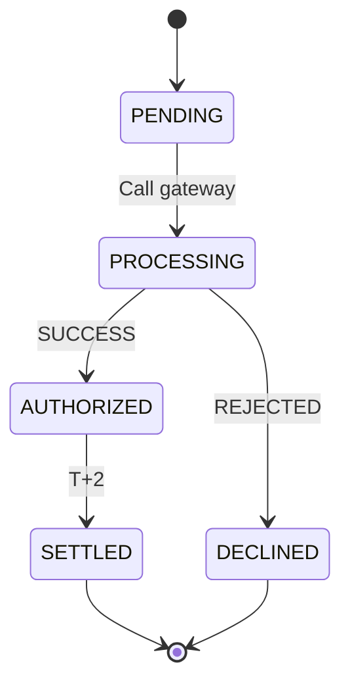

# Flows: Modeling the Machine

Once you've defined your **Data**, you need to model the **Flows** — the way your software actually *behaves*. In Chronos, you define your business logic using **Journey** and **Statemachine**.

---

## 1. `journey` — The Engine of Value

A **Journey** is the most important shape in Chronos. It's a complete, end-to-end "story" of how a user (or an AI agent) interacts with the system to achieve an outcome. 

### **Why use it?**
- To map a sequence of **Steps** that a user takes.
- To specify **Preconditions** (what must be true before starting).
- To define **Variants** (how to handle errors or alternative paths).
- To document **Outcomes** (success/failure) for the business.

### **Example (Healthcare AI Triage)**

```chronos
/// The main patient experience for AI-assisted symptom triage.
journey PatientTriage {
    actor: Patient
    
    preconditions: [
        "Patient is authenticated",
        "Patient has agreed to AI-triage terms"
    ]
    
    steps: [
        step DescribeSymptoms {
            action: "Patient describes symptoms in natural language"
            expectation: "AI extracts clinical indicators and potential urgency"
            telemetry: [SymptomCaptured, AIModelInvoked]
        },
        step ReviewUrgency {
            @confidence(target: "95%")
            action: "AI suggests an urgency level (e.g., HIGH)"
            expectation: "System routes the case to a Doctor if urgency is HIGH"
            outcome: TransitionTo(URGENT_REVIEW)
        }
    ]
    
    variants: {
        LowConfidence: {
            trigger: AIConfidenceLowError
            steps: [
                step AskClarifyingQuestion {
                    action: "AI asks a follow-up question for detail"
                    expectation: "Patient provides more context"
                    outcome: ReturnToStep(DescribeSymptoms)
                }
            ]
        }
    }
    
    outcomes: {
        success: "Patient is routed to the correct level of care",
        failure: "Patient is advised to go to the Emergency Room"
    }
}
```

---

## 2. `statemachine` — The Lifecycle of a Domain Object

A **Statemachine** defines the lifecycle of a specific field in an entity. It controls what states an object can be in and how it moves between them.

### **Why use it?**
- To prevent "impossible" state transitions (e.g., an Order shouldn't be `SHIPPED` before it's `PAID`).
- To define **Guards** (the conditions that must be met to change state).
- To define **Actions** (the side-effects that happen during a transition).

### **Example (Fintech Payment Lifecycle)**

```chronos
/// Manages the lifecycle of a payment from PENDING to SETTLED.
statemachine PaymentLifecycle {
    entity: Payment
    field: status
    
    states: [PENDING, PROCESSING, AUTHORIZED, SETTLED, DECLINED, REFUNDED]
    initial: PENDING
    terminal: [SETTLED, DECLINED, REFUNDED]
    
    transitions: [
        PENDING -> PROCESSING {
            action: "Call payment gateway API"
        },
        PROCESSING -> AUTHORIZED {
            guard: "Gateway returned SUCCESS"
            action: "Lock funds in account"
        },
        AUTHORIZED -> SETTLED {
            guard: "Settlement window reached (T+2)"
            action: "Emit SettlementEvent"
        },
        PROCESSING -> DECLINED {
            guard: "Gateway returned REJECTED"
        }
    ]
}
```

---

### **Visualizing Flows**

One of the most powerful features of Chronos is its ability to automatically generate visual diagrams from your code. 

**Statemachine Visualization:**



---

### **The TPM Cheat Sheet: Journey vs. Statemachine**

| Feature | Journey | Statemachine |
|---------|---------|--------------|
| **Focus** | The **User Experience** (UI/UX). | The **Data Integrity** (Logic). |
| **Steps** | Interactive actions and outcomes. | Atomic state transitions. |
| **Output** | Maps to **User Stories** and PRDs. | Maps to **State Diagrams** and Code Logic. |
| **Actors** | Includes a specific Actor (Patient, AI). | Is actor-agnostic (system logic). |
