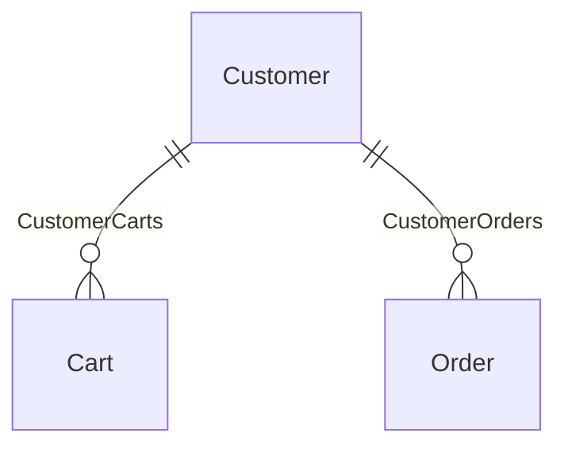
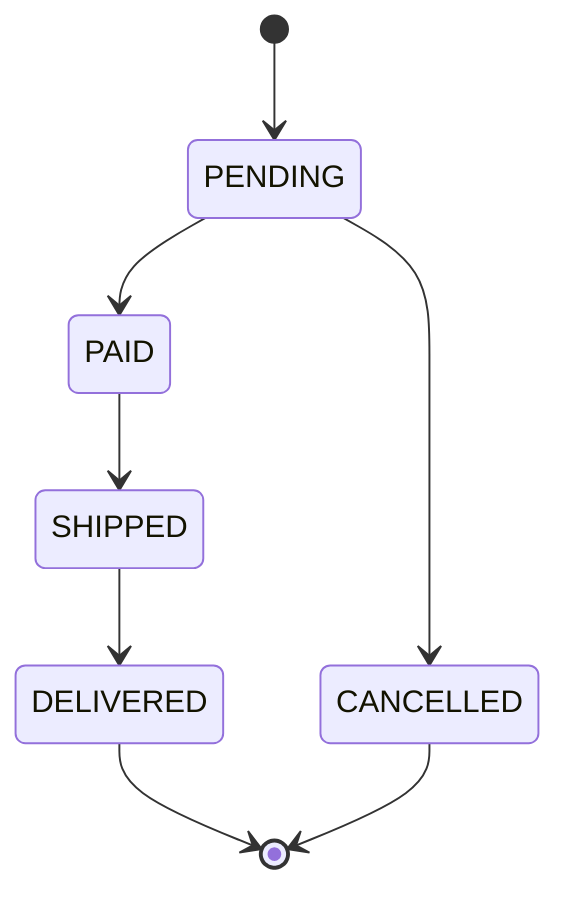

# Chronos Product Requirements Document

## Namespaces

- `dogfood.checkout`
- `dogfood.common`
- `dogfood.payments`

## Executive Summary

This PRD covers 2 journeys, 5 entities, 4 value objects, 2 enumerations, 3 actors, 2 policies, 3 error types, and 1 state machine across 3 namespaces.

**Journeys:**

- **dogfood.checkout.AuthenticatedCheckout** — RegisteredCheckoutConversion → >85%
- **dogfood.checkout.GuestCheckout** — CheckoutConversion → >75%

**Compliance Frameworks:**

- GDPR
- PCI-DSS

## Table of Contents

- [Journeys](#journeys)
  - [dogfood.checkout.AuthenticatedCheckout](#dogfoodcheckoutauthenticatedcheckout)
  - [dogfood.checkout.GuestCheckout](#dogfoodcheckoutguestcheckout)
- [Data Model](#data-model)
  - [Entities](#entities)
  - [Value Objects](#value-objects)
  - [Enumerations](#enumerations)
  - [Collections](#collections)
- [Global Invariants](#global-invariants)
- [Relationships](#relationships)
- [State Machines](#state-machines)
- [Actors](#actors)
- [Policies](#policies)
- [Prohibitions](#prohibitions)
- [Error Catalog](#error-catalog)
- [Telemetry Catalog](#telemetry-catalog)

---

## Journeys

### dogfood.checkout.AuthenticatedCheckout

> Registered-member checkout that pre-populates saved addresses and payment instruments.
> Returning customers complete checkout in fewer steps than the guest flow because the
> system fetches their default shipping address and preferred payment method automatically.
> The actor only needs to confirm pre-filled details rather than entering them from scratch.
> Higher conversion target reflects the reduced friction for known customers.
>
> **Actor:** CustomerActor | **Owner:** product-checkout-team | **KPI:** RegisteredCheckoutConversion → >85% | **Compliance:** GDPR

**Preconditions**

- Cart is not empty
- Actor is logged in with a verified email address

**Happy Path**

| Step | Action | Expectation | Outcome | SLO | Telemetry | Risk |
|------|--------|-------------|---------|-----|-----------|------|
| ReviewCart | Review cart items alongside the pre-filled shipping address and payment method | System displays cart contents, the customer's default shipping address, and their preferred payment instrument (masked PAN); a summary of total cost including shipping is shown | — | ≤ 500 ms | CartViewed | — |
| ConfirmShipping | Confirm the pre-filled shipping address or select an alternative saved address | System stores the confirmed address against the order and updates the shipping cost estimate; the actor can add a new address without leaving the flow | — | — | ShippingConfirmed | — |
| ConfirmPayment | Confirm the pre-filled payment method or choose a different saved instrument | System records the chosen instrument; full PAN is never displayed — only the last four digits and card type are shown | — | — | PaymentMethodConfirmed | — |
| SubmitPayment | Confirm and submit the order for payment with a single tap or click | System authorises payment and transitions the order to PAID; the actor lands on a confirmation page showing order number and estimated delivery window | TransitionTo([PAID](#dogfoodcheckoutorderstatus)) | ≤ 3000 ms | PaymentAuthorizationAttempted | Gateway dependency |

**Variants**

#### PaymentDeclined

**Trigger:** [PaymentDeclinedError](#dogfoodpaymentspaymentdeclinederror)

| Step | Action | Expectation | Outcome | SLO | Telemetry | Risk |
|------|--------|-------------|---------|-----|-----------|------|
| ShowDeclineMessage | Read the decline reason and select a different saved payment method | System presents all saved instruments for re-selection alongside the decline reason; the actor can also add a new card inline | — | — | PaymentDeclinedShown | — |

**Outcome:** ReturnToStep([ConfirmPayment](#dogfoodcheckoutauthenticatedcheckout-confirmpayment))

#### GatewayTimeout

**Trigger:** [PaymentGatewayTimeoutError](#dogfoodpaymentspaymentgatewaytimeouterror)

| Step | Action | Expectation | Outcome | SLO | Telemetry | Risk |
|------|--------|-------------|---------|-----|-----------|------|
| RetryOrChangeMethod | Wait for status confirmation, then retry or choose another saved method | System performs an idempotent status check and presents a clear retry option only after confirming the prior charge did not apply | — | — | PaymentRetryOffered | Status check must be idempotent to prevent double-charging |

**Outcome:** ReturnToStep([ConfirmPayment](#dogfoodcheckoutauthenticatedcheckout-confirmpayment))

**Outcomes**

- ✅ Success: Order exists with status PAID; loyalty points are credited within 5 minutes; confirmation email is queued
- ❌ Failure: Order remains in PENDING status; the actor is shown a clear error message with actionable retry options

### dogfood.checkout.GuestCheckout

> Guest checkout flow that allows unauthenticated shoppers to purchase without an account.
> The actor supplies a shipping address and payment details inline during the flow.
> This path is optimised for first-time and low-friction conversions; every additional
> step is a potential drop-off point, so minimising form fields is a key design constraint.
> Conversion rate is the primary KPI; target is set at >75% of sessions that reach ReviewCart.
>
> **Actor:** CustomerActor | **Owner:** product-checkout-team | **KPI:** CheckoutConversion → >75% | **Compliance:** GDPR

**Preconditions**

- Cart is not empty
- Actor is not logged in

**Happy Path**

| Step | Action | Expectation | Outcome | SLO | Telemetry | Risk |
|------|--------|-------------|---------|-----|-----------|------|
| ReviewCart | Review cart items and totals before proceeding | System displays cart contents, computed subtotal, estimated shipping cost, and applicable taxes in the customer's preferred currency | — | ≤ 500 ms | CartViewed | — |
| EnterShipping | Enter a delivery address | System validates the address format, calculates a final shipping cost, and stores the address against the pending order | — | — | ShippingAddressEntered | Address validation depends on a third-party geocoding service; degraded mode must fall back to format-only validation |
| ChoosePayment | Select a payment method and enter card or wallet credentials | System tokenises payment details via the certified gateway; raw card data never reaches application servers | — | — | PaymentMethodChosen | — |
| SubmitPayment | Submit the order for payment authorisation | System requests authorisation from the gateway, records the result, and transitions the order to PAID on approval; the actor sees a confirmation page with order number | TransitionTo([PAID](#dogfoodcheckoutorderstatus)) | ≤ 3000 ms | PaymentAuthorizationAttempted | Gateway dependency; timeouts are indeterminate and must trigger a status-check flow before any retry is offered to prevent double-charging |

**Variants**

#### PaymentDeclined

**Trigger:** [PaymentDeclinedError](#dogfoodpaymentspaymentdeclinederror)

| Step | Action | Expectation | Outcome | SLO | Telemetry | Risk |
|------|--------|-------------|---------|-----|-----------|------|
| ShowDeclineMessage | Read the decline reason surfaced by the system | System displays a clear, jargon-free explanation of the decline and prominently offers the option to try a different payment method without losing cart contents | — | — | PaymentDeclinedShown | — |

**Outcome:** ReturnToStep([ChoosePayment](#dogfoodcheckoutguestcheckout-choosepayment))

#### CardExpired

**Trigger:** [CardExpiredError](#dogfoodpaymentscardexpirederror)

| Step | Action | Expectation | Outcome | SLO | Telemetry | Risk |
|------|--------|-------------|---------|-----|-----------|------|
| PromptNewCard | Enter a replacement payment method after seeing the expiry notice | System detects the expiry before authorisation, displays a targeted message explaining the issue, and allows the actor to enter a new card without losing cart contents or re-entering shipping details | — | — | CardExpiredHandled | — |

**Outcome:** ReturnToStep([ChoosePayment](#dogfoodcheckoutguestcheckout-choosepayment))

#### GatewayTimeout

**Trigger:** [PaymentGatewayTimeoutError](#dogfoodpaymentspaymentgatewaytimeouterror)

| Step | Action | Expectation | Outcome | SLO | Telemetry | Risk |
|------|--------|-------------|---------|-----|-----------|------|
| RetryOrChangeMethod | Wait for the system to determine payment status, then retry or choose another method | System performs an idempotent status check using the correlationId and presents a clear retry path only once it has confirmed no charge was applied | — | — | PaymentRetryOffered | Status check must be idempotent; offering retry before status is confirmed risks double-charging the customer |

**Outcome:** ReturnToStep([ChoosePayment](#dogfoodcheckoutguestcheckout-choosepayment))

**Outcomes**

- ✅ Success: Order exists with status PAID; inventory is reserved; confirmation email is queued within 60 seconds
- ❌ Failure: Order remains in PENDING status and the actor can retry payment or abandon the cart

---

## Data Model

### Entities

#### dogfood.checkout.Cart

> An in-progress product selection created when a shopper first adds an item.
> Carts are ephemeral: they are converted into an Order on successful payment or
> abandoned if the shopper does not complete checkout. Abandoned carts older than
> 30 days are purged by a scheduled cleanup job; a re-engagement email is sent at 24h.

| Field | Type |
|-------|------|
| id | String |
| customerId | String |
| items | LineItemList |
| metadata | MetadataMap |

#### dogfood.checkout.Order

> The canonical record of a placed order, created when a Cart is checked out.
> An Order is effectively immutable once in PAID status; post-payment modifications
> (e.g. address corrections, quantity adjustments) require a separate amendment flow
> tracked by the Operations team. Orders that remain in PENDING status for more than
> 24 hours without a successful payment attempt are automatically cancelled by a
> background job, releasing any inventory holds.

| Field | Type |
|-------|------|
| id | String |
| customerId | String |
| status | OrderStatus |
| total | Money |
| items | LineItemList |
| shippingAddress | Address |

**Invariants:**

- **TotalNonNegative** (error)
  - Expression: `total != null`
  - Message: Order total must be non-negative

#### dogfood.common.Customer

> The canonical customer record shared across all bounded contexts.
> A Customer is created on first registration and persists for the account lifetime.
> Email is the primary identifier for transactional communications and must be verified
> before checkout is permitted. PII fields are subject to GDPR deletion requests;
> deletion must propagate to all downstream services within 30 days.

| Field | Type |
|-------|------|
| id | String |
| email | String |
| defaultShipping | Address |

**Invariants:**

- **EmailLooksValid** (warning)
  - Expression: `email != ""`
  - Message: Customer email must not be empty

#### dogfood.common.Product

> A sellable item in the product catalogue.
> Products are owned by the Catalogue team and replicated to the checkout service
> via the ProductSynced domain event. Price is snapshotted into each LineItem at
> the moment of checkout to protect in-progress orders from subsequent price changes.

| Field | Type |
|-------|------|
| id | String |
| sku | String |
| title | String |
| price | Money |

#### dogfood.payments.PaymentInstrument

> A tokenised payment instrument stored on behalf of a registered customer.
> Raw card numbers are never persisted — only the masked PAN and a gateway-issued token
> are stored. Instruments are soft-deleted when the customer exercises their right to erasure;
> hard deletion is deferred until all open orders referencing the instrument are settled.

| Field | Type |
|-------|------|
| id | String |
| customerId | String |
| method | PaymentMethod |
| maskedPan | String |
| billingAddress | Address |

### Value Objects

#### dogfood.common.Address

> A physical postal address used for shipping and billing.
> line2 is optional (not all addresses have an apartment or suite number).
> Country must be an ISO 3166-1 alpha-2 code (e.g. "US", "GB").

| Field | Type |
|-------|------|
| line1 | String |
| line2 | String |
| city | String |
| region | String |
| postalCode | String |
| country | String |

#### dogfood.common.LineItem

> A single entry in a cart or order representing one product at a specific quantity.
> unitPrice is the price at the time the item was added; it does not change after
> the cart is frozen at checkout even if the catalogue price is updated later.

| Field | Type |
|-------|------|
| productId | String |
| quantity | Integer |
| unitPrice | Money |

#### dogfood.common.Money

> Monetary value as an amount/currency pair following ISO 4217.
> All money fields across the system must use this type rather than a bare numeric.
> Arithmetic on Money values must preserve currency — mixing currencies is a domain error
> and must be rejected at the service boundary.

| Field | Type |
|-------|------|
| amount | Float |
| currency | String |

#### dogfood.payments.PaymentAuthResult

> The result returned by the payment gateway after an authorisation attempt.
> A result with approved=false must be surfaced to the actor with a human-readable reason.
> The authCode is only populated on approval and must be stored for chargeback defence.

| Field | Type |
|-------|------|
| approved | Boolean |
| authCode | String |
| declineReason | String |

### Enumerations

#### dogfood.checkout.OrderStatus

> Valid lifecycle states for an Order.
> Transitions between states are governed by the OrderLifecycle state machine.
> Terminal states (DELIVERED, CANCELLED) cannot be exited; any further modification
> requires creating a new amendment record rather than altering the original order.

| Member | Ordinal |
|--------|----------|
| PENDING | 1 |
| PAID | 2 |
| SHIPPED | 3 |
| DELIVERED | 4 |
| CANCELLED | 5 |

#### dogfood.payments.PaymentMethod

> Payment methods accepted at checkout.
> The method determines which authorisation flow the payment service invokes.
> APPLEPAY and PAYPAL use redirect-based flows; CARD uses a direct gateway submission.

| Member | Ordinal |
|--------|----------|
| CARD | 1 |
| PAYPAL | 2 |
| APPLEPAY | 3 |

### Collections

#### dogfood.common.LineItemList

> Ordered collection of line items within a cart or order.

`List<LineItem>`

#### dogfood.common.MetadataMap

> Flexible string-keyed metadata for extensibility across domain objects.
> Used for A/B test cohort flags, affiliate codes, internal audit tags, and any
> context that does not warrant a first-class field.

`Map<String, String>`

---

## Global Invariants

Cross-entity constraints that must always hold true:

### dogfood.common.PositiveQuantitiesOnly

> Global constraint: all quantity and monetary values must be non-negative.

**Scope:** Product, Customer

**Expression:** `true`

**Severity:** warning

**Message:** Placeholder global invariant for dogfood coverage

---

## Relationships

#### dogfood.checkout.CustomerCarts

> A Customer may have multiple active or historical Carts; only one should be active
> at any given time on a single device. Multi-device scenarios may result in multiple
> active carts which are merged when the customer authenticates.

**Description:** Customer can have multiple carts over time; only one active cart per session
**From:** [Customer](#dogfoodcommoncustomer) **→** [Cart](#dogfoodcheckoutcart) (one_to_many)
**Semantics:** aggregation

#### dogfood.checkout.CustomerOrders

> A Customer accumulates Orders over their account lifetime.
> This relationship powers order history, loyalty calculations, and support lookup.
> It must be preserved even after account deletion (orders are anonymised, not deleted)
> to satisfy financial record-keeping obligations.

**Description:** Full history of orders placed by a customer; used for loyalty and support lookups
**From:** [Customer](#dogfoodcommoncustomer) **→** [Order](#dogfoodcheckoutorder) (one_to_many)
**Semantics:** aggregation

---

## State Machines

### dogfood.checkout.OrderLifecycle

> Governs all valid status transitions for an Order through its fulfilment lifecycle.
> Transitions are driven by domain events — OrderPaid, OrderShipped, OrderDelivered,
> and OrderCancelled — emitted by the Order Service. Guards are evaluated before any
> transition is applied; a failed guard must result in a rejection event, not a silent no-op.
> Once an Order reaches a terminal state (DELIVERED or CANCELLED) no further transitions
> are permitted; any dispute or amendment must be tracked in a separate bounded context.

**Entity:** Order | **Field:** status | **Initial:** PENDING | **Terminal:** DELIVERED, CANCELLED

| From | To | Guard | Action |
|------|----|-------|--------|
| PENDING | PAID | `true` | Emit OrderPaidEvent; reserve inventory allocation; queue customer confirmation email |
| PAID | SHIPPED | `true` | Emit OrderShippedEvent; record carrier tracking number; notify customer with tracking link |
| SHIPPED | DELIVERED | `true` | Emit OrderDeliveredEvent; credit loyalty points; close open fulfilment task |
| PENDING | CANCELLED | `true` | Emit OrderCancelledEvent; release inventory hold; issue refund if payment was captured |

---

## Actors

#### dogfood.common.CustomerActor

> The primary end-user of the storefront — a person browsing and purchasing products.
> CustomerActor covers both guest (unauthenticated) and registered (authenticated) shoppers.
> Actors in this role have access to all self-service checkout and account management flows.

**Description:** A shopper using the storefront UI

#### dogfood.common.FulfillmentActor

> An internal system or warehouse operative responsible for picking, packing, and shipping.
> FulfillmentActor interacts with the order management system after payment is confirmed.
> This actor is never customer-facing and operates within the fulfilment bounded context.

**Description:** Warehouse operative or automated fulfilment system

#### dogfood.common.SupportAgent

> A customer support representative who can act on behalf of shoppers.
> SupportAgent inherits CustomerActor capabilities and additionally has access to
> order management, refund initiation, address correction, and dispute resolution flows.
> All SupportAgent actions are audit-logged with the agent's employee ID.

**Description:** Support team member handling refunds and disputes
**Extends:** [CustomerActor](#dogfoodcommoncustomeractor)

---

## Policies

#### dogfood.common.DataRetention

> Policy mandating GDPR-compliant handling of all personal data collected by the platform.
> Personal data must be purgeable within 30 days of a customer deletion request.
> Retention periods are defined per data class in the Data Classification Register and
> must be enforced by automated purge jobs that run nightly.

**Description:** Personal data must be purgeable on request and retained only as long as legally necessary. Customers may invoke their right to erasure at any time via account settings. All purge operations must be idempotent and produce an audit record.
**Compliance:** GDPR

#### dogfood.common.PciCompliance

> Policy mandating PCI-DSS Level 1 compliance for all payment data handling.
> No raw cardholder data may enter application servers; all card details must be
> tokenised through the certified payment gateway before any persistence layer is touched.
> Developers must complete annual PCI-DSS training, and a QSA must perform an annual audit.

**Description:** All payment card data must be handled, stored, and transmitted in accordance with PCI-DSS Level 1 requirements. Tokenisation is mandatory. Raw PAN and CVV must never be logged, stored in plaintext, or transmitted outside the certified cardholder data environment.
**Compliance:** PCI-DSS

---

## Prohibitions

#### dogfood.payments.NoRawPaymentData

> Negative requirement: do not store sensitive payment data in application systems.

**Description:** The system must never persist raw PAN, CVV, or full magnetic-stripe track data. All card data must be tokenised through the certified payment gateway before any application-layer persistence is invoked. Violation of this requirement triggers immediate PCI incident response.
**Scope:** PaymentInstrument
**Severity:** critical

---

## Error Catalog

#### dogfood.payments.CardExpiredError

> The card presented by the actor has passed its expiry date.
> This is detected during tokenisation, before authorisation is attempted.
> The actor must supply a replacement payment method; this error cannot be retried
> with the same card under any circumstances.

**Code:** PAY-003 | **Severity:** high | **Recoverable:** Yes
**Message:** The selected card has expired
**Payload:** expiryMonth: Integer, expiryYear: Integer

#### dogfood.payments.PaymentDeclinedError

> The issuing bank declined the transaction.
> This is the most common payment failure scenario. The actor should be shown
> the human-readable decline reason and offered the option to retry with a
> different payment method. The gatewayCode is logged for support investigations.

**Code:** PAY-001 | **Severity:** high | **Recoverable:** Yes
**Message:** Payment was declined by the gateway
**Payload:** gatewayCode: String, retryable: Boolean

#### dogfood.payments.PaymentGatewayTimeoutError

> The payment gateway did not respond within the configured timeout window.
> This failure is treated as indeterminate: the charge may or may not have been applied.
> The system must query gateway status using the correlationId before offering a retry,
> to prevent the actor from being double-charged.

**Code:** PAY-002 | **Severity:** high | **Recoverable:** Yes
**Message:** Payment gateway did not respond in time
**Payload:** timeoutMs: Integer, correlationId: String

---

## Telemetry Catalog

| Event | Journey | Step | Path |
|-------|---------|------|------|
| CardExpiredHandled | dogfood.checkout.GuestCheckout | PromptNewCard | Variant: CardExpired |
| CartViewed | dogfood.checkout.AuthenticatedCheckout | ReviewCart | Happy |
| CartViewed | dogfood.checkout.GuestCheckout | ReviewCart | Happy |
| PaymentAuthorizationAttempted | dogfood.checkout.AuthenticatedCheckout | SubmitPayment | Happy |
| PaymentAuthorizationAttempted | dogfood.checkout.GuestCheckout | SubmitPayment | Happy |
| PaymentDeclinedShown | dogfood.checkout.AuthenticatedCheckout | ShowDeclineMessage | Variant: PaymentDeclined |
| PaymentDeclinedShown | dogfood.checkout.GuestCheckout | ShowDeclineMessage | Variant: PaymentDeclined |
| PaymentMethodChosen | dogfood.checkout.GuestCheckout | ChoosePayment | Happy |
| PaymentMethodConfirmed | dogfood.checkout.AuthenticatedCheckout | ConfirmPayment | Happy |
| PaymentRetryOffered | dogfood.checkout.AuthenticatedCheckout | RetryOrChangeMethod | Variant: GatewayTimeout |
| PaymentRetryOffered | dogfood.checkout.GuestCheckout | RetryOrChangeMethod | Variant: GatewayTimeout |
| ShippingAddressEntered | dogfood.checkout.GuestCheckout | EnterShipping | Happy |
| ShippingConfirmed | dogfood.checkout.AuthenticatedCheckout | ConfirmShipping | Happy |
