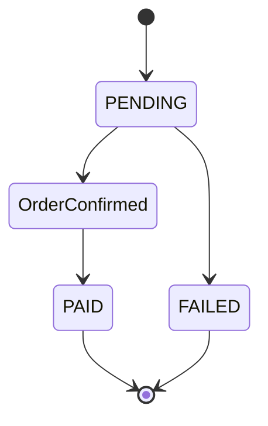

# com.example.checkout — Product Requirements

## Executive Summary

This PRD covers 1 journey, 2 entities, 1 value object, 3 enumerations, 1 actor, 1 policy, 1 error type, and 1 state machine across 1 namespace.

**Journeys:**

- **CheckoutJourney** — checkout_completion_rate → 95%

**Compliance Frameworks:**

- PCI-DSS

## Table of Contents

- [Journeys](#journeys)
  - [CheckoutJourney](#checkoutjourney)
- [Data Model](#data-model)
  - [Entities](#entities)
  - [Value Objects](#value-objects)
  - [Enumerations](#enumerations)
  - [Collections](#collections)
- [State Machines](#state-machines)
- [Actors](#actors)
- [Policies](#policies)
- [Error Catalog](#error-catalog)
- [Event Catalog](#event-catalog)
- [Telemetry Catalog](#telemetry-catalog)

---

## Journeys

### CheckoutJourney

> Guides a registered customer through the checkout process.
>
> **Actor:** Customer | **KPI:** checkout_completion_rate → 95% | **Compliance:** PCI-DSS

**Preconditions**

- Cart contains at least one item
- Customer is authenticated

**Happy Path**

| Step | Action | Expectation | Outcome | SLO | Telemetry | Risk | Input | Output |
|------|--------|-------------|---------|-----|-----------|------|-------|--------|
| ReviewCart | Customer reviews cart contents | Cart summary is displayed with correct totals | — | — | CartReviewed, PageViewed | Stale price data may cause discrepancy | — | — |
| EnterPaymentDetails | Customer enters payment card details | Payment form validates and tokenises card | — | — | PaymentFormOpened | PCI scope expansion if card data is logged | — | — |
| ConfirmOrder | Customer submits the order | Order record is persisted with status PENDING | TransitionTo([OrderConfirmed](#orderstatus)) | — | OrderSubmitted | — | — | — |

**Variants**

#### PaymentDeclined

**Trigger:** [PaymentDeclinedError](#paymentdeclinederror)

| Step | Action | Expectation | Outcome | SLO | Telemetry | Risk | Input | Output |
|------|--------|-------------|---------|-----|-----------|------|-------|--------|
| NotifyDeclined | System notifies customer of the decline | Error message is displayed with retry option | ReturnToStep([EnterPaymentDetails](#checkoutjourney-enterpaymentdetails)) | — | — | — | — | — |

**Outcome:** ReturnToStep([EnterPaymentDetails](#checkoutjourney-enterpaymentdetails))

**Outcomes**

- ✅ Success: Order record exists with status PAID and confirmation email sent
- ❌ Failure: Cart remains intact and no charge is made

---

## Data Model

### Entities

#### CartItem

> A single line item in the shopping cart.

| Field | Type | Required |
|-------|------|----------|
| id | String | ✓ |
| quantity | Integer |  |
| price | Long |  |
| discount | Float |  |
| active | Boolean |  |
| createdAt | Timestamp |  |
| thumbnail | Blob |  |
| metadata | Document |  |

#### Order

| Field | Type | Required |
|-------|------|----------|
| id | String | ✓ |
| status | OrderStatus |  |

### Value Objects

#### Money

| Field | Type |
|-------|------|
| amount | Float |
| currency | Currency |

### Enumerations

#### CartState

| Member | Ordinal |
|--------|----------|
| EMPTY | — |
| ACTIVE | — |
| ABANDONED | — |
| CHECKED_OUT | — |

#### OrderStatus

| Member | Ordinal |
|--------|----------|
| PENDING | — |
| OrderConfirmed | — |
| PAID | — |
| FAILED | — |

#### PaymentStatus

| Member | Ordinal |
|--------|----------|
| PENDING | 1 |
| PROCESSING | 2 |
| PAID | 3 |
| DECLINED | 4 |

### Collections

#### CartItemList

`List<CartItem>`

#### TagMap

`Map<String, List<String>>`

---

## State Machines

### OrderLifecycle

**Entity:** Order | **Field:** status | **Initial:** PENDING | **Terminal:** PAID, FAILED

| From | To | Guard | Action |
|------|----|-------|--------|
| PENDING | OrderConfirmed | — | — |
| OrderConfirmed | PAID | — | — |
| PENDING | FAILED | — | — |

---

## Actors

#### Customer

**Description:** A registered shopper who can add items to the cart and complete purchases

---

## Policies

#### PaymentSecurity

**Description:** Payment card data must never be stored in plaintext
**Compliance:** PCI-DSS

---

## Error Catalog

#### PaymentDeclinedError

**Code:** PAYMENT_DECLINED | **Severity:** high | **Recoverable:** Yes
**Message:** Payment gateway returned a declined response
**Payload:** declineReason: String, retryAllowed: Boolean

---

## Event Catalog

### CartReviewed

_No payload fields._

### OrderSubmitted

_No payload fields._

### PageViewed

_No payload fields._

### PaymentFormOpened

_No payload fields._

---

## Telemetry Catalog

| Event | Journey | Step | Path |
|-------|---------|------|------|
| CartReviewed | CheckoutJourney | ReviewCart | Happy |
| OrderSubmitted | CheckoutJourney | ConfirmOrder | Happy |
| PageViewed | CheckoutJourney | ReviewCart | Happy |
| PaymentFormOpened | CheckoutJourney | EnterPaymentDetails | Happy |
